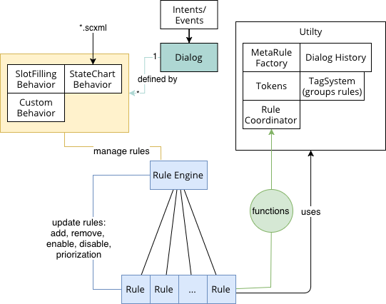

# REngine

[TOC]




A rule engine, where rules act on tokens (arbitrary data like a map). The main idea is to define the dialog behavior through the set of active rules and put the intelligence into management components (e.g. state charts, slot filling, …) that creates those rules dynamically. Features are:

- Persistent dialog state
   - Stores a complete history of the dialog progress
   - Rewind (e.g. jump to other states of the dialog, e.g. say "undo" to go one step back)
      - **TODO** redo command. should be easy: Just don't overwrite the history after jumping back
      - Allows: Pausing the demo during demonstration (during explanation)
   - **TODO** Replay function: If the tokens (input, output) are stored as well, the whole dialog can be simulated (may be more complex...)
   - **TODO** If there are multiple possibilities how the dialog can progress, one could create branches, follow them in parallel and keep only the promising branches.
- MetaRuleFactory: Easy way to use reoccurring dialog patterns
   - Confirm / Disconfirm-Rule: for yes/no questions
   - Repeat-Rule ("can you repeat that?") outputs the last TTS again (up to x seconds)
   - **TODO** Create help-rule: "what can I say?"
   - **TODO** timeouts e.g. pro active behavior -> use timeouts to trigger rules
   - **TODO** snapshot rule
   - **TODO** selection rule (choose one option from a set of actions ~ 'radio button group')
   - **TODO** rule waiting for output to finish
- Web API:
   - Overview about active rules and their tags
   - Overview about the state chart (e.g. state diagram + active state)
   - Trigger tokens -> Simulate input eases testing of the dialog
- Management Components:
   - Manual rule handling
   - State chart (**TODO** partial scxml support, history and parallel state unsupported atm)
   - Slot Filling **TODO** impl
   - A combination of them


## Components

### Rules

- Rules are a persistent data structure. They don't change. If they have to too, you need to create a new rule and remove the old one.
- The structure of a rule is void -> void: Hence, Condition checking and execution is done through additional objects that are captured in the context of the function. In general, they have access to the dialog object such that the knowledge base can be accessed etc...
- Coordination of rules: **TODO**
- execution order is based on priority value. rules with higher priority value are executed later.
- The token set is empty for each iteration and filled by the rules.
- Using java's stream API makes writing rules easy: 
```java
var rs = dialog.getRuleSystem();
var tagSystem = dialog.getTagSystem();

rs.addRule("greetings", (sys) -> {
  // check for tokens with the intent 'greetings'
  sys.getTokens().stream()
          .filter(t -> t.payloadEquals("intent", "greetings"))
          .findFirst()
          .ifPresent(t -> {
              functions
              sys.removeToken(t);
              // request tts output via token
              sys.addToken(Token.builder("output_tts").add("utterance", "hello!").build());
              // disable this rule for four seconds
              sys.disable("greetings", Duration.ofSeconds(4));
          });
});
// set the priority of the greetings rule.
rs.setPriority("greetings", 20);
// associate the greetings rule with the meta tag
tagSystem.addTag("greetings", "meta");
```


### Tag-System

Tag-System: Allows to annotate multiple rules with a tag, which facilates to enable multiple rules simultaneously. 


### Token

Simple persistent data structure in the form of String -> Object. In general used as input event to forward intents into the dialog.


### Dialog

Core class that makes the components accessible to each other.


### RuleCoordinator


### other

- Grammar rules are chosen and merged based on the current set of active rules


## TODOs

#### Refactor project:
    - core: no deps? (slf4j)
    - app framework + web: spring boot
    - app (concrete use case)

#### Check whether the grammar recognition works on hololens
According to docs yes, but the API is too restrictive? 
it can only load a grammar from file. 
Hence it should be checked whether it is possible to store and then load the grammar for replacing it during runtime.


#### ASR: Streaming Mic from Browser to AudioManager

- comfortable way for voice input, because webbrowser are ubiquitous
- probably requires https (e.g. in chrome mandatory) 


#### Add to Doc
- Where to save data? sensor data (data is derived from the real world or simulation; e.g. changes frequently) should be stored in a knowledge base that can be accessed by the dialog. The dialog itself should not store any information in the knowledge base that represents its own state. Such information should be stored inside a behavior in an inmutable or persistent data structure. This is necessary to create persistent dialog history.
- State chart as an abstraction: Rule may fire events in into the state chart which in response change the set of active rules. A state chart manages a specific set of rules which defined in table (*.csv file). The state chart is stored in the scxml format. The implementation does not support *parallel* or *history* states. It should be checked whether they are necessary or meaningful, because with the persistent dialog history the system supports already a 'history'-feature.