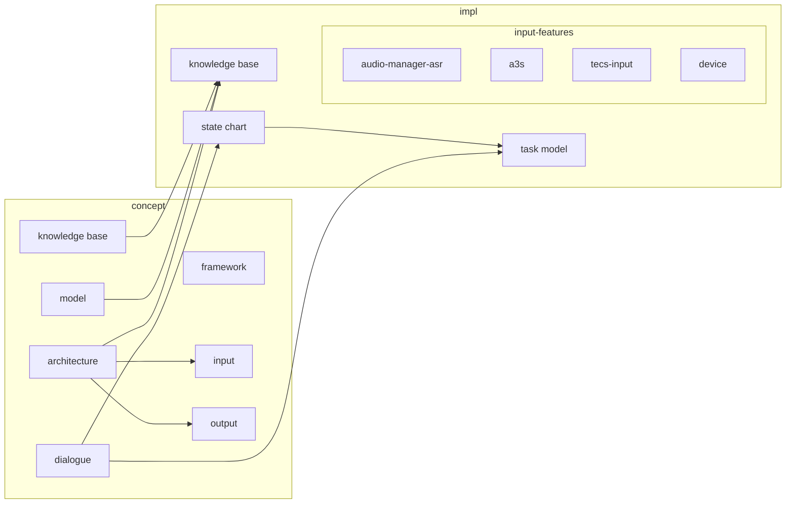

# Dialog System
[TOC]

## Execution
```mermaid
gantt
    title A Gantt Diagram
    dateFormat  DD.MM.YYYY
    section Architecture
    Concept           	:arch-concept, 01.07.2018, 30d
    Impl     			:after arch-concept  , 7d
    section Dialogue
    Task in sec      : 01.08.2018  , 12d
    another task      : after arch-concept, 24d
    section KnowledgeBase
    Concept				:de.dfki.tocalog.core.kb-concept, 01.07.2018, 30d
	Concept2			:de.dfki.tocalog.core.kb-concept2, after model-concept, 10d
    section Model
    Concept 			:model-concept, 23.08.2018, 30d
    section Input
    Concept		: fusion-concept, 30d
    
```

maybe a flow chart is better for our purposes...




## Modules

### Dialog

### Input and Fusion
- Input and fusion components are managed in a publish-subscribe style
    - distinction between events and information in a knowledge store
    - A input component receives events as triggers
    - A input component produces new events based on the incoming events and the knowledge base
    

#### Components
- AudioManager
    - Convert SpeechInputs
    - Grammar Converter
- SpatialFusion -> split into several modules
    - Estimote 
    - Kinect
    - SessionManager
    - (Google Glass)
    - Hololens

### Knowledge Base
#### Generation
- Serialization similar to thrift (binary + json)
    - **TODO** other lib? msg-pack?
- Suitable format for fast, safe (concurrent) and remote KB access
- RPC interface for remote access 
- Generator creates class that are easy and safe to use
    - **TODO**  which input format?
    - ReadOnly representation
    - format:
        - primitive types: i32, i64, double, string
        - collections: list, set, map
        - ref type: is mapped to string
        - embedded type: serialized with the object
        - not supported: `list<string, list<...>>` -> use additional structure for the inner data type
- discuss: one model for everything distributed component?
    - model update -> component update
    - otherwise: model update -> bridge update
    - probably dependents on the component

### Output and Fission
#### Components


## Meetings
### 11.07.18 (MF, TS, MK, YK)
- Konzepte
    - Architektur
        - Event-basierte Module für Input --> Blackboard
        - Output evtl. eher als Pipeline: eine Präsentationskomponente steuert die Ausgabevorbereitung; Baumstruktur als Format
    - Event-Kommunikation
        - Aktuell keine Filterung seitens der DP; jede Komponente schaut selbst, ob sie das Event braucht
        - Intern Java, extern TECS
    - Knowledge Base
        - Möglichkeit von schreibgeschützen Referenzen
        - Verschiedene Arten von Stores, die explizit angesprochen werden
        - Externer Zugriff momentan noch nicht geklärt
    - Objektmodell
        - Sprache?
        - i/o-Nachrichten inkl. modalitätsspezifische Repräsentation
        - State-Dialogmodell
            - Task-Modell (= Metadialog)
            - Kommunikative Funktionen (= teilweise Metadialog)
            - Session-Modell
            - Geräte
            - Domänenspezifisches
- Komponenten
    - DialogStateManager
        - Ist eine State Machine
    - TaskDialogManager
        - Generiert aus Task-Modell dynamisch States für obigen
    - Fusionskomponente(n)
        - Insb. FADE-like
    - PresentationPlanner
    - ProjectManager
    - DeviceManager


### 28.06.18 (MF, TS, MK, YK, CC)
- Von SiAM-dp
  - DialogManager
    -  --> neuer StateChart-Interpreter
    - Vielleicht in Zukunft andere Klassen
    - States als obligatorisches Basismodell?
  - Task-Modell als Meta-Modell
    - Neu implementieren basierend auf aktuellen Ideen
  - Backchannel
    - Eher weglassen, da aktuell (technisch) zu kompliziert
  - ProjectManager --> neu
  - DeviceManager
    - MADMCS Device Platform als Alternative integrieren
  - SessionManager
    - Macht aktuell nicht viel, schreibt Sessions in die KB
    - Könnte evtl. die Unity Group Functions enthalten, aber optional
  - GrammarEditor
    - Für ABNF und den Grafischen Editor Übernahmemöglichkeiten prüfen
    - Sonst einfach GRXML ausgeben
    - Verknüpfungen von Hypothesen mit Regeln
    - In Zukunft auch intent-basierte Erkennung ähnlich unterstützen
    - SpeechInterpreter-Komponente?
    - KnowledgeManager
        - Für neue Knowledge Base neu bauen ohne EMF
    - Fusion / FADE
        - Referenzauflösung (Deiktisch, Elliptisch, Personen) portieren
        - Robert Diss für Backgrounds zu FADE
    - PresentationPlanner --> YK
    - Debug-GUI
        - Überlegen, was nützlich und praktisch ist
        - Neu implementieren? jop
    - HTML-GUI-Modell
        - Wird nicht weiter verfolgt
        - Datenaustausch mit externer GUI aber schon
- OSGi oder nicht --> eher nein
- Dialogplattform als Service (ohne GUI und Installation)
- Klassenmodell mit einfachen Konzepten, möglichere Generierung in Sprachen
    - Selbst ausdenken oder was finden
    - Default-Serialisierung
    - Editor für das Modell ggf. erst später
    - Allgemeines Modell als Domänenmodell erweiterbar
    
